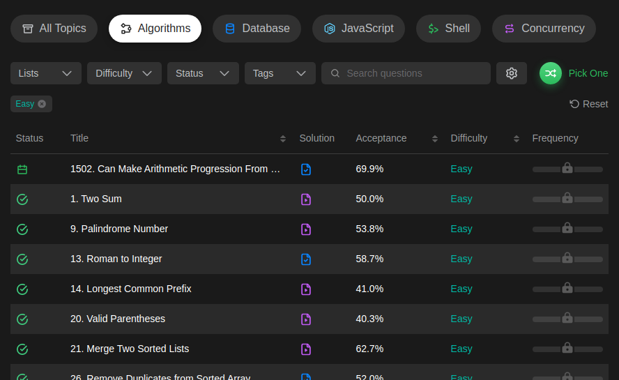

<h1 align="center">Модуль задач с   
    <a href='https://leetcode.com/'>LeetCode</a>
    
     
</h1>

<h1 align="center">Сложность Easy</h1>

 

В git не получается сохранить порядок задач как в системе  
Поэтому задачи сгруппированы по 50 и разделены на страницы 

 

