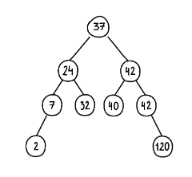

<h1 align="center"><a href='https://ru.hexlet.io/courses/algorithms-trees/lessons/binary/theory_unit'>Бинарные деревья</a></h1>

Бинарное дерево или двоичное дерево — это дерево, в котором у каждого из его узлов не более двух дочерних узлов. При этом каждый дочерний узел тоже представляет собой бинарное дерево.

<h1 align="center">Бинарные деревья поиска</h1>

Бинарные деревья поиска отличаются от обычных бинарных деревьев тем, что хранят данные в отсортированном виде. 

- Все значения в узлах левого дочернего поддерева меньше значения родительского узла
- Все значения в узлах правого дочернего поддерева больше значения родительского узла
- Каждый дочерний узел тоже является бинарным деревом поиска

<h1 align="center"><a href='https://ru.hexlet.io/courses/algorithms-trees/lessons/binary/theory_unit'>Обход дерева</a> </h1>

<h2>DFS: Поиск в глубину</h2>

Прямой обход (КЛП)(pre-order): корень → левое поддерево → правое поддерево

Центрированный обход (ЛКП)(in-order): левое поддерево → корень → правое поддерево

Обратный обход (ЛПК) (post-order): левое поддерево → правое поддерево → корень

<h2>BFS: Поиск в ширину </h2>

Поиск в ширину (BFS): обход узлов дерева по уровням: от корня и далее

