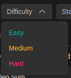

<h1 align="center">Решения Алгоритмов  
    <a href='https://leetcode.com/'>LeetCode</a>
    
     
</h1>

<h1 align="center">Привет </a> 
</h1>

<h2>Для чего этот репозиторий:</h2>

Тут я буду размещать свои решения ✊ 

<h2>Структура репозитория: </h2> 

    

    Все задачи имеют свою сложность.
    

    

    
    

    

    По этому принципу они размещены в папках в этом репозитории
    

    .
    ├── Easy
    │   ├── <Номер в системе>.<Название задачи> - Модуль с задачей
    │   │   ├── main.py                         - Решение
    │   │   └── README.md                       - Ссылка на задачу + пояснения
    │
    ├── MyGapsInTheory                         - Мои пробелы в теории
    │
    └── README.md                                - мы тут

<h2>Моя статистика:😈</h2>

 

